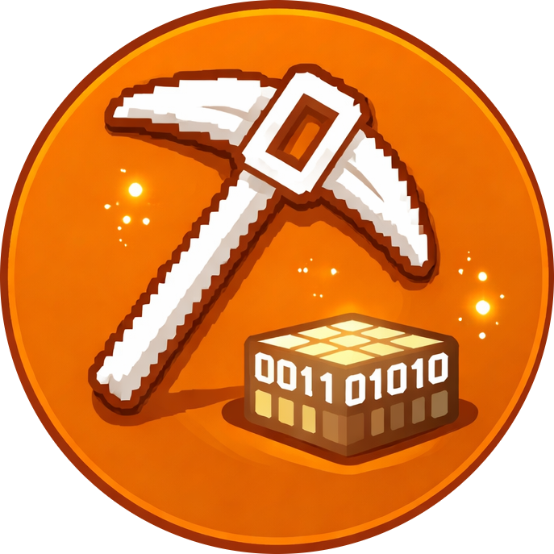

<p align="center">
  
  
</p>

<p align="center">
  <strong>Proof-of-work settlement on Solana.</strong><br>
  CPU and GPU hardware search nonces off-chain. Solana verifies, settles, and advances the chain state.
</p>

<p align="center">
  <a href="https://blockmine.dev"></a>
  <a href="https://t.me/blockmine"></a>
  <a href="https://x.com/blockminelabs"></a>
</p>

<p align="center">
  <a href="#overview"></a>
  <a href="docs/protocol.md"></a>
  <a href="docs/architecture.md"></a>
  <a href="docs/miner-client.md"></a>
  <a href="docs/security-notes.md"></a>
  <a href="docs/tokenomics.md"></a>
  <a href="MINING_CURVE.md"></a>
</p>

<p align="center">
  
  
  
  
  
  
  
  
</p>

## Overview

Blockmine is a proof-of-work settlement protocol on Solana.

The chain does not brute-force hashes. The chain publishes one canonical challenge, one canonical target, one canonical reward, and one canonical settlement path. CPU and GPU hardware search nonce space off-chain. The program verifies valid proofs, routes fees, pays BLOC rewards from a pre-funded vault, and opens the next logical block.

The accepted proof is:

```text
H = SHA256(challenge || miner_pubkey || nonce_le_u64)
```

with acceptance rule:

```text
H < target
```

The target is stored on-chain as a full 256-bit threshold. Reward issuance advances on successfully settled blocks, not on stale timers.

## Mainnet References

| Item | Value |
| --- | --- |
| Program ID | `FgRe73gAkZPhxpiCFHMYMfLR4dabDaB1FDVFazVTcCtv` |
| Reward vault | `ApA17DcAYh7pVCcbUemQaDaqW1YxXaU62b73cUBHmdcS` |
| Mint | `9AJa38FiS8kD2n2Ztubrk6bCSYt55Lz2fBye3Comu1mg` |
| Treasury wallet | `8DVGdWLzDu8mXV8UuTPtqMpdST6PY2eoEAypK1fARCMb` |
| Default RPC | `https://api.mainnet-beta.solana.com` |
| Fixed accepted-block fee | `0.01 SOL` |
| Treasury BLOC share | `1%` |

## Technical Index

| Document | Scope |
| --- | --- |
| [docs/protocol.md](docs/protocol.md) | State machine, proof rule, submit path, stale rotation, challenge derivation |
| [docs/architecture.md](docs/architecture.md) | Off-chain search vs on-chain settlement, account model, event trail |
| [docs/miner-client.md](docs/miner-client.md) | CLI miner, desktop miner, wallet manager, CPU/GPU flow |
| [docs/security-notes.md](docs/security-notes.md) | Core invariants, fee routing, vault routing, non-goals |
| [docs/tokenomics.md](docs/tokenomics.md) | Supply, allocation, reward accounting, cap structure |
| [MINING_CURVE.md](MINING_CURVE.md) | Exact era schedule and Scarcity tail |
| [LIVE_CONFIG_NOTES.md](LIVE_CONFIG_NOTES.md) | Public live constants and runtime references |

## System Shape

### Off-chain

- fetch the current block snapshot
- iterate nonces on CPU or GPU
- validate candidates against the current 256-bit target
- submit only a winning nonce

### On-chain

- store the canonical live block
- verify `SHA256(challenge || miner_pubkey || nonce_le_u64)`
- transfer the fixed `0.01 SOL` accepted-block fee to the treasury wallet
- split the BLOC reward `99% / 1%`
- emit the solved-block event trail
- retarget difficulty and open the next block

## Repository Layout

- `onchain/` - Anchor workspace and Solana program
- `miner-client/` - Rust CLI miner and desktop client
- `docs/` - technical notes for the public core
- `packaging/` - Windows and macOS packaging helpers
- `scripts/` - local build wrappers

## Build

### Windows

```powershell
powershell -ExecutionPolicy Bypass -File .\packaging\windows\build-miner-exe.ps1
```

### macOS

```bash
chmod +x packaging/macos/*.command
chmod +x packaging/macos/scripts/*.sh
./packaging/macos/build-macos.command
```
